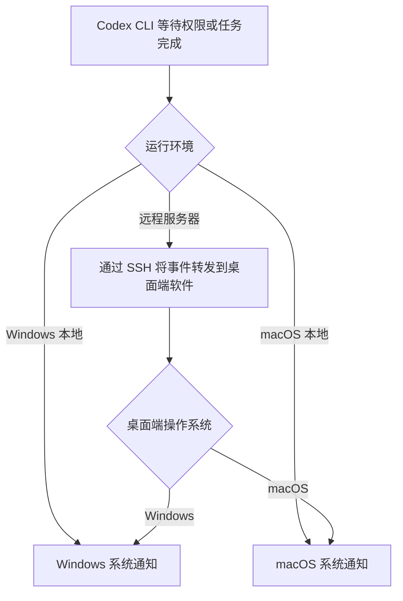
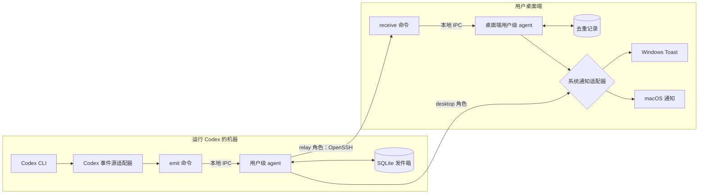
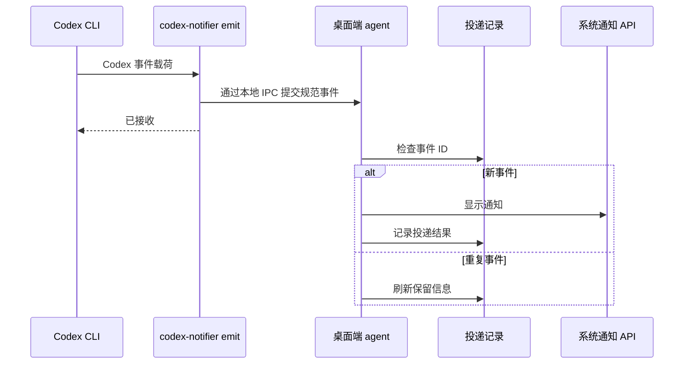
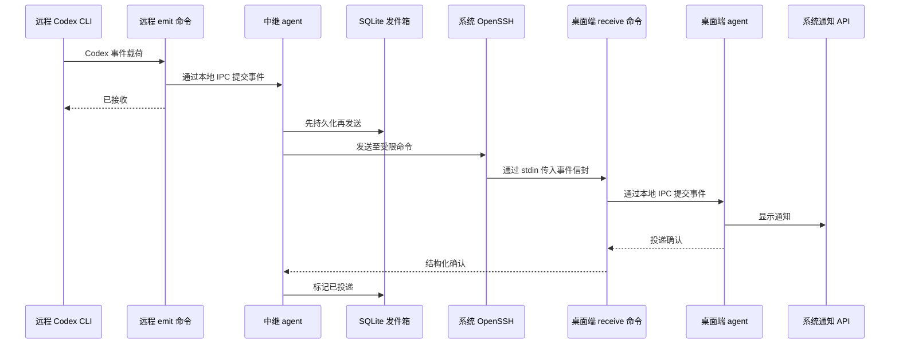

# codex-notifier

[English](README.md)

`codex-notifier` 是一个规划中的 Codex CLI 跨平台通知桥。它把需要用户关注的
Codex 事件转换为 Windows 或 macOS 原生系统通知，并支持 Codex 运行在远程
服务器上的场景。

> 当前状态：阶段 01-20 已实现或完成审计，并在具备所需环境的平台上通过验证；兼容性证据、架构决策、Rust workspace、三平台
> 质量门禁、规范事件领域模型、分层配置、跨平台路径规则与结构化脱敏日志模型均已
> 建立，事务性 SQLite 发件箱/去重存储、有界的用户级本地 IPC、角色感知 agent
> 生命周期、持久背压和有界 worker 排空也已完成；Codex CLI 0.144.5 的 CLI
> `Stop` hook 与 app-server 命令审批请求均已有精确适配器、有界本地 `emit` 路径和
> 只读能力报告。Windows WinRT 适配器、策略映射、诊断与自动化契约已经实现；产品
> 身份 Toast 投递以及真实的应用级关闭、专注助手、身份缺失和 Session 0 状态已在
> Windows 10 22H2 验证，全新身份的首次投递也已在 Windows 11 验证。macOS
> UserNotifications 适配器、应用包契约、授权诊断、原生 CI 与无图形会话检查已经
> 实现；首次授权、明确拒绝、两类事件横幅与勿扰抑制已在 macOS 14.8.7 和当前
> macOS 26.4 runner 上验证。本地桌面端生命周期现已支持安装精确验证过的任务完成
> hook 与用户级自启动资源、运行 agent、查看状态、提交两类显式测试事件、幂等升级，
> 并在保留事件状态与用户修改的前提下卸载自有资源。受限 SSH `receive` 边界、脱敏
> 确认、专用 forced-key 模板和 SSH 安全诊断均已实现；真实系统 OpenSSH forced-command
> 会话与拒绝矩阵已在 Linux loopback 测试架构中验证。持久中继角色现会以固定参数
> 调用系统 OpenSSH、校验有界确认、分类传输/信任故障，并通过带抖动的指数退避和
> 有界死信完成重试。同一 Linux 测试架构已验证离线排队、自动恢复、至少一次重发与
> 桌面端去重。Windows/macOS SSH 服务端配置仍明确标记为未验证。阶段 17 的只读
> doctor、角色感知 status、人类/JSON 一致输出、稳定健康退出码，以及感知投递结果的
> 本地/远程自测均已通过 Windows、macOS 14、当前 macOS 与 Linux relay 门禁。阶段 18
> 进一步加入三个崩溃窗口的恢复、100 次重试去重、队列/版本/离线故障覆盖、保守的性能与
> 资源预算，以及四条路径的可靠性矩阵。真实的远程到 Windows 和远程到 macOS 连续原生
> 路径仍明确标记为未验证；Linux loopback 证据不作为任何桌面平台的验证结果。阶段 19
> 新增带版本的 Windows x86-64、macOS universal 与 Linux x86-64/AArch64 验证归档、
> 校验和、SPDX 与许可证材料、package 生命周期门禁，以及默认关闭的受保护签名、公证与
> 发布任务。所有分支验证 package 和聚合归档均已通过。生产 Windows 签名、Apple
> Developer ID/公证与受保护 tag 运行仍未验证，因此这些未签名或 ad-hoc 产物不是发布候选。
> 阶段 20 已完成证据链、兼容性、威胁、secret/配置、文档与回滚审计，结论为
> **no-go**。受保护的 `release` environment 尚不存在，两条连续远程桌面路径也无法在
> 已签名候选上重跑，因此没有创建正式 tag 或 release。

实施顺序与各阶段验收门槛见 [`stages.md`](stages.md)。

## 产品范围

首个版本面向两类用户事件：

- `approval_requested`：Codex 正在等待用户批准某项操作。
- `task_completed`：Codex 的当前轮次或任务已经完成。

原始产品流程转述如下：



### 目标

- 在不暴露公网服务的前提下投递原生系统通知。
- 本地与远程 Codex 会话使用统一的事件模型。
- Codex 事件入口只负责快速提交，避免阻塞 Codex。
- SSH 暂时不可用时，通过有界持久化队列保证事件最终投递。
- 发送端、中继端、接收端和诊断工具使用同一个小型可执行文件。
- 安装和卸载过程明确、可审计且可回滚。

### 非目标

- Linux 桌面通知；Linux 仅作为远程中继主机受到支持。
- 移动端推送、邮件、聊天工具或托管式中继服务。
- 从通知中远程控制 Codex。
- 传输完整提示词、模型回复或终端日志。
- 取代 Codex 自身的审批界面。

## Codex 集成边界

Codex 的事件能力可能随版本和使用界面而变化，因此所有集成都隔离在事件源
适配器之后。

| 产品事件 | 所需 Codex 能力 | 当前行为 |
| --- | --- | --- |
| 任务完成 | 可供外部程序调用的轮次完成通知或 hook 事件 | 已按 Codex CLI 0.144.5 的 CLI `Stop` hook 精确结构实现，规范化并入队为 `task_completed`。 |
| 请求审批 | 可供外部程序调用的审批请求通知或 hook 事件 | 已按 Codex CLI 0.144.5 app-server 的 `item/commandExecution/requestApproval` 请求精确实现；普通 CLI hook 仍未验证。 |

只读 `doctor codex` 与未来 installer 使用和实际适配器选择相同的 fixture 门禁能力
报告。项目不得把抓取终端输出或
读取私有会话日志作为静默降级方案。每个精确 Codex 版本和使用界面的适配器契约
都必须由脱敏后的真实事件 fixture 提供门禁；本项目目前不承诺所有 Codex 版本都能
向外部程序暴露上述两类事件。

首个版本下限为 Codex CLI 0.144.5。阶段 01 已在 Windows 10 22H2 上验证
`codex exec` 的 `Stop` hook 可提供任务完成事件，app-server JSON-RPC 接口可提供
审批请求。普通 CLI 的 `PermissionRequest` 生命周期 hook 仍未验证，在取得真实证据
前必须报告为不可用。详见 [`docs/compatibility.md`](docs/compatibility.md) 与
[ADR-0001](docs/decisions/0001-supported-versions.md)。初始操作系统构建下限为
Windows 10 22H2（19045）和 macOS 14。阶段 12 与阶段 13 已为这些平台声明提供所需
真实状态原生通知证据；阶段 19 已实现默认关闭的发布包签名与公证门禁，但生产身份与
受保护 tag 路径仍未验证。

## 总体架构

项目规划使用 Rust workspace 和六边形架构。领域与应用逻辑不依赖 Codex 原始
载荷、SSH 命令、IPC 细节或操作系统通知 API。



### 运行角色

运行角色必须由配置显式指定，不能根据机器是否看起来“无界面”来推断。

| 角色 | 常见主机 | 职责 |
| --- | --- | --- |
| `desktop` | Windows 或 macOS 工作站 | 通过本地 IPC 接收并去重事件，显示原生系统通知。 |
| `relay` | 远程 Linux、Windows 或 macOS 服务器 | 接收本机 Codex 事件，持久化排队，再通过 SSH 转发至指定桌面端。 |

两个角色由同一可执行文件提供。桌面端处理本地通知时不依赖 SSH，中继端也不会
调用桌面通知 API。

### 组件职责

| 组件 | 职责 |
| --- | --- |
| Codex 事件源适配器 | 将特定版本的 Codex 载荷转换为规范事件。 |
| `emit` 命令 | 校验 hook 输入，通过本地 IPC 交给 agent，并快速返回。 |
| Agent | 负责路由、持久化、重试调度、去重和优雅关闭。 |
| 本地 IPC 适配器 | 使用仅当前用户可访问的 Windows 命名管道或 Unix domain socket。 |
| SQLite 存储 | 持久化中继发件箱和桌面端投递记录，并执行有界保留策略。 |
| SSH 传输 | 使用参数数组调用系统 OpenSSH 客户端和预配置主机别名。 |
| `receive` 命令 | 作为受限 SSH 入口，校验单个事件信封后交给桌面端 agent。 |
| 系统通知适配器 | 将规范事件映射为 Windows Toast 或 macOS UserNotifications。 |
| 安装器 | 配置 Codex 集成、用户级自启动和可选的受限 SSH 访问。 |
| 诊断器 | 检查 Codex 事件能力、agent、IPC 权限、SSH 连通性和通知权限。 |

### 本地事件流程



### 远程事件流程



首个版本假设中继主机能通过预配置 SSH 主机别名访问桌面端，通常依赖可信局域网
或 VPN。反向 SSH 隧道可以在后续作为独立传输适配器加入，但不属于首版范围。

## 事件契约

所有适配器都产生带版本的规范事件信封，逻辑字段如下：

| 字段 | 用途 |
| --- | --- |
| `schema_version` | 支持传输格式的兼容演进。 |
| `event_id` | 首次接入时生成的 UUIDv7，重试期间保持不变。 |
| `kind` | `approval_requested` 或 `task_completed`。 |
| `occurred_at` | 事件源提供的 UTC 时间，接收端对其范围进行校验。 |
| `source` | 脱敏后的主机标签、可选项目标签和 Codex 会话标识。 |
| `presentation` | 有长度限制的标题、正文和紧急程度。 |
| `routing` | 可选桌面配置名称，不能是任意命令或网络地址。 |
| `extensions` | 有命名空间和大小限制的前向兼容元数据。 |

协议版本 1 拒绝未知的必需协议版本、事件类型和对象字段。提示词、模型输出、环境
变量、绝对工作目录和凭据默认排除在事件之外。

协议版本 1 已由 [ADR-0006](docs/decisions/0006-event-protocol-v1.md) 冻结，完整规范
见 [`docs/event-protocol-v1.md`](docs/event-protocol-v1.md)。编码后的单事件上限为
16,384 字节；前向兼容元数据只能放在有命名空间和大小限制的 `extensions` 中。

## 本地 IPC 契约

本地事件生产者与用户级 agent 在每条连接上只交换一个规范事件和一个确认。每帧
使用四字节大端长度前缀，请求上限为 16,384 字节，确认上限为 2,048 字节。确认
携带匹配的事件 ID，并使用 `accepted`、`duplicate`、`delivered` 或 `rejected`
状态；拒绝详情仅包含有界标识符、重试标志和单行安全消息。

客户端和服务端均使用有界的连接与 I/O 超时，服务端还限制活动连接任务数。默认
超时为两秒、并发任务上限为 32；可配置硬边界分别为 10 毫秒至 30 秒以及 1 至
256 个任务。Windows 使用仅所有者可访问的 DACL 创建命名管道，并验证对端进程
属于当前用户。macOS 与 Linux 使用绝对 Unix socket 路径，将 socket 放在当前
用户拥有的 `0700` 目录内，以 `0600` 模式创建，并把对端凭据与有效用户 ID 比较。

活动端点不能被替换。程序可以恢复当前用户拥有的陈旧 Unix socket，但会拒绝
符号链接、无关文件、错误所有者和不安全的目录权限。本地 IPC 不使用 HTTP 客户端，
也不读取 `HTTP_PROXY`、`HTTPS_PROXY` 或 `ALL_PROXY`。

## Agent 生命周期契约

agent 角色只来自经过校验的配置。组合层先绑定配置档专属 IPC 端点，再打开有界
SQLite 队列，并且只初始化一套角色适配器：`desktop` 初始化原生通知端口而不初始化
SSH，`relay` 初始化 SSH 投递端口而不初始化原生通知 API。中继端口以固定参数调用
系统 OpenSSH 客户端；桌面端口只选择当前受支持操作系统的原生通知适配器。

生命周期只按 `starting`、`ready`、`draining`、`stopped` 的顺序前进。本地提交
只有在事务性入队后才会确认，重复事件 ID 使用独立确认状态。持久队列本身就是背压
边界，已接收事件不会创建无界内存任务或 channel。默认 worker 数为四，硬上限为
64。

关闭时先进入 `draining`，再停止 IPC 接收。新提交会收到安全且可重试的拒绝确认；
协作式投递收到取消信号，每个 lease 都会被确认、重试、转入死信，或由 drop guard
退回队列。超过配置的 10 毫秒至 30 秒优雅关闭期限后，只有在 lease guard 能保证
事件重新持久化的前提下才会中止 worker。关闭释放会撤销本次 lease 的 attempt，
反复重启 agent 不会耗尽正常投递的重试次数。

## 投递语义

- `emit` 到本地 agent 的提交采用至少一次语义。
- 远程投递采用至少一次语义，桌面端通过 `event_id` 去重。
- 只有收到结构化确认后，事件才会从发件箱移除。
- SQLite schema 版本 1 使用 `IMMEDIATE` 事务处理入队、租约、确认、重试、死信、
  回执、保留和迁移变更。租约在精确到期边界重新可用；成功确认会在同一事务中先写入
  去重回执，再删除规范发件箱载荷。
- 重试采用带随机抖动的指数退避，并设置可配置上限。
- 队列长度、单事件大小、重试期限和投递记录保留期都有硬性上限。
- 永久性校验或认证错误进入小型死信记录，只保存原因与安全元数据，不保留完整载荷。
- 发件箱行在取得租约时会重新校验其索引事件 ID 和类型。回执与死信不包含规范 JSON
  或展示正文，schema 迁移失败会保持源事务不变。
- 系统通知 API 返回成功只代表操作系统接受了通知，不代表用户已经看到或打开。
- 若进程在原生 API 接受通知后、SQLite 回执提交前崩溃，租约恢复后可能再次显示通知。
  若提前记录回执则可能造成静默丢失，因此版本 1 在这个狭窄窗口中明确选择至少一次恢复。

### Windows 原生通知

Windows 适配器只在 `cfg(windows)` 下编译，并使用 `windows-rs` WinRT Toast API。
私密策略始终显示 ADR-0003 的固定文案；公开文案同时要求应用显式配置和规范事件标记
为公开。原生文本会再次过滤控制字符并限制长度，Toast XML 使用 DOM 节点构造而不做
字符串插值。应用免打扰会抑制弹窗和声音，但仍把通知交给通知中心。版本 1 不包含
动作、启动 URI、回复框、命令或远程审批控制。

后端校验产品 AUMID `LeopardRich.CodexNotifier` 及安装器拥有的当前用户注册表
身份，拒绝 Session 0，并分别诊断身份缺失、应用级关闭、用户全局关闭、组策略关闭、
API 不可用和投递拒绝。已注册身份首次使用时，可以在 Windows 尚未创建通知设置记录
前提交第一条 Toast。Windows 专注助手与勿扰仍由操作系统管理；诊断报告
`system_managed`，不声称能够读取公开 Toast API 没有暴露的活动状态。打包资源和
可回滚所有权契约见
[`packaging/windows/README.md`](packaging/windows/README.md)。

适配器自动化契约已在 Windows 10 22H2 通过。使用产品 AUMID 创建临时的当前用户
非打包应用注册后，被忽略的双事件冒烟测试已经通过：WinRT 接受了两条真实 Toast，
Windows 通知数据库也保存了两条准确的固定私密载荷。真实的应用级关闭和专注助手
“仅优先通知”状态均已测试并恢复。在 Windows 11 Enterprise build 26200 Arm64
上，全新安装级身份无需原始通知或既有设置记录即可通过相同的双事件产品冒烟测试；
通知中心也在勿扰开启时渲染了产品通知组。详见
[`docs/verification/stage-12.md`](docs/verification/stage-12.md)。

### macOS 原生通知

macOS 适配器只在 `cfg(target_os = "macos")` 下编译，通过安全 Rust 绑定调用 Apple
现代 UserNotifications 框架，并精确固定到能够使用 macOS 14 SDK 构建的绑定版本；
原生 CI 现已同时覆盖 macOS 14 与当前 `macos-latest` 镜像。它要求签名应用包使用
固定标识
`io.github.leopardrich.codex-notifier`，校验可执行文件确实从该 `.app` 内运行，并
要求当前用户存在 Aqua launch domain。只读诊断会区分应用身份缺失、尚未请求授权、
明确拒绝或应用级关闭、无 GUI 会话以及原生 API 不可用。授权只能通过显式方法请求；
事件投递本身不会弹出权限请求。

共享的隐私与文本长度策略会在调用 UserNotifications 之前执行。每个请求使用规范事件
ID，且只包含标题和正文，不含 category、动作、URL、回复框、命令或 user-info 载荷。
常规投递使用默认声音和 active interruption level；应用免打扰会移除声音并使用
passive level。适配器绝不使用会绕过专注模式的 time-sensitive 或 critical level，
因此 macOS 专注与勿扰始终优先，诊断报告 `system_managed`。

应用包、Developer ID 签名、公证与 Aqua LaunchAgent 的资源契约见
[`packaging/macos/README.md`](packaging/macos/README.md)。被忽略的冒烟测试会自行
构造前台测试应用包，支持临时签名或显式测试签名，向 LaunchServices 注册后在进程
主线程启动 AppKit。授权路径会提交两类事件；全新状态拒绝路径会验证
`DisabledForApplication`；专注模式路径会提交不请求绕过级别的稳定探测事件。

macOS 14.8.7 与 macOS 26.4 的真实托管 runner 检查已执行首次授权流程，并从截图
确认两类固定私密横幅；独立的全新 runner 验证了明确拒绝。通过控制中心启用勿扰后，
两个版本都没有显示探测横幅，原生日志把稳定事件 ID 与活动专注模式下的延迟投递关联
起来，随后原有专注状态已恢复。永久 CI 还覆盖无 Aqua 会话诊断。由于仓库没有 Apple
签名 secret，这些检查使用只在临时 runner 上受信任的签名链；Apple Developer ID
签名与公证仍未验证。阶段 19 已验证 universal ad-hoc 归档，并实现默认关闭的受保护
发布路径。详见 [`docs/verification/stage-13.md`](docs/verification/stage-13.md) 与
[`docs/verification/stage-19.md`](docs/verification/stage-19.md)。

## 安全模型

桌面端 `receive` 命令是主要信任边界。

- 使用操作系统自带的 OpenSSH 客户端，不在程序内嵌 SSH 服务端。
- 每组中继端到桌面端关系使用专用 SSH 密钥与主机别名。
- 在 SSH 服务端能力允许时，把授权密钥强制限制到 `codex-notifier receive`，并禁用
  端口转发、PTY、Shell 和其他命令。
- 固定或显式登记桌面端主机密钥，禁止关闭主机密钥校验。
- 事件信封通过 stdin 传入；事件内容不能插入 Shell 命令、命令行参数、通知动作、
  URL 或文件路径。
- 在持久化或调用系统 API 前，校验协议版本、事件类型、时间、字符串长度、总大小
  和速率限制。
- 本地 IPC 与状态文件仅允许当前操作系统用户访问。
- 常规日志对事件载荷脱敏，SSH 私钥绝不能放入项目配置。
- 首版通知仅用于展示，不提供直接批准 Codex 操作的按钮。

经审计的密钥限制、主机密钥登记流程、权限要求、诊断状态与撤销步骤见
[`docs/restricted-ssh.md`](docs/restricted-ssh.md)。

## 配置模型

配置按以下优先级叠加：内置默认值、用户配置、指定配置档以及显式 CLI 覆盖项。
环境变量只用于部署集成，不承载事件载荷或私钥。

配置模式版本 1 已实现以下配置组：

| 配置组 | 所属设置示例 |
| --- | --- |
| `agent` | 显式桌面端/中继端角色、配置档、逻辑 IPC 端点和关闭超时。 |
| `codex` | 事件源适配器选择以及接受的任务完成/审批请求事件类型。 |
| `desktop` | 免打扰行为以及私密/公开通知内容策略。 |
| `relay` | 预配置的 OpenSSH 主机别名、目标配置档、连接超时和有界重试计划。 |
| `storage` | 绝对状态路径和有界队列容量。 |
| `logging` | 日志级别和绝对日志目录；配置诊断信息会脱敏。 |

默认通知隐私模式使用通用标题和正文，不显示主机、项目、命令、提示词、回复或路径。
应用级免打扰默认关闭，操作系统专注/勿扰策略始终优先；显式启用应用免打扰后，事件
会静默投递而不是延迟为过时通知。详见
[ADR-0003](docs/decisions/0003-notification-privacy.md)。

Windows 上的用户配置与状态遵循 `%APPDATA%` 和 `%LOCALAPPDATA%`，macOS 遵循
`~/Library/Application Support`。中继主机在可用时遵循 XDG 基础目录规范。

主配置文件在 Windows 上为 `%APPDATA%\codex-notifier\config.toml`，在 macOS
上为 `~/Library/Application Support/codex-notifier/config.toml`，在 XDG
中继主机上为 `${XDG_CONFIG_HOME:-~/.config}/codex-notifier/config.toml`。
状态和日志分别使用 `%LOCALAPPDATA%`、对应的 macOS Application Support/Logs
目录，或 `${XDG_STATE_HOME:-~/.local/state}`。显式路径基目录以及配置的状态/
日志目录必须为绝对路径，最终状态目录必须可写。

当前 TOML 文件都必须包含 `config_version = 1`。加载器可迁移有界的版本 0
`role` 和可选 `ssh_host` 键。未知设置、不支持的版本、非法角色/端点以及禁止的
敏感键都会产生稳定且安全的错误分类。私钥、访问令牌、密码、提示词、模型输出和
原始事件载荷不是合法配置值，也不会出现在配置调试输出中。

## 命令界面

本地桌面端生命周期、两类低级 Codex 事件入口、受限 SSH 接收端、持久中继发送端
以及完整的只读运维诊断已经实现：

| 命令 | 可用性 | 用途 |
| --- | --- | --- |
| `--version` | 已实现 | 输出用于归档与升级校验的 package 版本。 |
| `emit task-completed` | 已实现 | 面向 Codex、接收已验证 `Stop` 载荷的有界本地事件入口。 |
| `emit approval-requested` | 已实现 | 接收已验证 app-server 命令审批请求的有界本地事件入口。 |
| `doctor codex` | 已实现 | 只读报告版本/界面能力与安装选择。 |
| `doctor ssh` | 已实现 | 只读报告主机密钥登记与授权文件权限。 |
| `agent` | 桌面端与中继端已实现 | 运行已配置的用户级角色进程。 |
| `receive` | 已实现 | 从受限 SSH 会话接收一个有界规范事件，并通过本地 IPC 转交。 |
| `install` / `uninstall` | 桌面端已实现 | 可逆地管理已验证 Codex hook 与 Windows/macOS 用户级自启动产物。 |
| `doctor` | 桌面端与中继端已实现 | 只读检查配置、Codex、agent、IPC、存储、通知、OpenSSH 与目标连通性。 |
| `test` | 桌面端与中继端已实现 | 提交任一显式模拟事件，并等待本地或远程桌面投递回执。 |
| `status` | 桌面端与中继端已实现 | 显示角色、安装、agent、队列年龄/计数、最近投递、存储与原生状态，不展示事件正文。 |

### Package 校验与设置

目前没有正式 `v0.1.0` release。现有 CI 归档是未签名或 ad-hoc 的工程验证产物，
不能作为可信发布候选安装。未来候选必须先通过校验和、对应平台 verifier、生产桌面
信任，以及 [`docs/release-checklist.md`](docs/release-checklist.md) 的每项门禁。

所有门禁给出 go 结论后，解压对应的已验证归档，并使用其中的可执行文件或脚本：

| 目标 | 安装与检查 | 移除 |
| --- | --- | --- |
| Windows x86-64 | 运行 `codex-notifier.exe install --codex-version 0.144.5`，再运行 `codex-notifier.exe doctor` 和 `codex-notifier.exe status` | 从外部解压归档而不是已安装副本运行 `codex-notifier.exe uninstall`。 |
| macOS 14+ | 通过 `Codex Notifier.app/Contents/MacOS/codex-notifier install --codex-version 0.144.5` 安装，再通过同一可执行文件运行 `doctor` 与 `status` | 通过外部已验证 app 中的可执行文件运行 `uninstall`。 |
| Linux relay | 运行 `./install.sh`，创建 relay 配置/SSH Host block，再运行已安装的 `codex-notifier doctor` | 运行 `./uninstall.sh`；配置与 SQLite 状态会保留。 |

解压前先验证 `SHA256SUMS`，并按 [`docs/release.md`](docs/release.md) 执行签名、
公证与逐归档命令。配置路径和键见上文；远程设置见
[`docs/restricted-ssh.md`](docs/restricted-ssh.md) 与
[`docs/relay-ssh.md`](docs/relay-ssh.md)；诊断见
[`docs/diagnostics.md`](docs/diagnostics.md)。卸载只移除自有资源，并有意保留持久事件状态。

### 本地桌面端生命周期

阶段 14 提供当前基于源码构建的 Windows 与 macOS 命令界面：

```text
codex-notifier install [--codex-version 0.144.5]
codex-notifier status [--format human|json]
codex-notifier test [task-completed|approval-requested] [--format human|json] [--wait-ms 100..180000]
codex-notifier uninstall
codex-notifier agent
```

省略 `--codex-version` 时，`install` 会调用 `codex --version`，且只接受精确验证过的
`codex-cli 0.144.5` 结果。安装过程以结构化方式合并一个 `Stop` hook，记录其精确
所有权，创建平台通知身份与用户级自启动资源，启动桌面端 agent，并报告原生通知
诊断。用户仍需在 Codex 中审阅 hook 信任。普通 CLI 审批 hook 不会被安装；即使
`test approval-requested` 可验证本地通知链路，安装结果仍明确报告
`approval_installation=report_unavailable`。

重复安装会原子替换此前拥有的 hook 与应用，不会增加重复 hook 或自启动项。
`status` 只报告有界元数据，并以只读方式检查 SQLite。`uninstall` 会移除精确匹配的自有 hook、自启动身份、
应用和未修改的 installer 创建配置；预先存在或已修改的 hook/配置内容会被保留，
SQLite 队列、投递记录和系统通知历史始终保留。Windows 上应从外部构建或下载的
可执行文件运行 `uninstall`，因为已安装进程无法删除自身目录。macOS 上的 `install`
必须从有效签名的 `Codex Notifier.app` 中运行。阶段 19 的验证归档已在两个桌面平台
执行该生命周期；生产 Developer ID 签名与公证仍是发布候选的阻断条件。

平台所有权细节见 [`packaging/windows/README.md`](packaging/windows/README.md)
与 [`packaging/macos/README.md`](packaging/macos/README.md)，执行证据见
[`docs/verification/stage-14.md`](docs/verification/stage-14.md)。

### 受限 SSH 接收

阶段 15 增加桌面端信任边界：

```text
codex-notifier receive
codex-notifier doctor ssh [--ssh-config <绝对路径>] [--known-hosts <绝对路径>] [--authorized-keys <绝对路径>]
```

`receive` 不是通用本地输入命令。它要求 OpenSSH 提供的
`SSH_ORIGINAL_COMMAND` 精确等于 `codex-notifier receive`，要求存在 SSH
连接标记，拒绝任何 PTY 标记，并且不接受 CLI 参数。命令最多读取 16,384 字节，
且只解析一个规范协议 v1 JSON 对象。合法事件通过与本地生产者相同的用户级 IPC
提交给已配置桌面 agent；agent 的有界确认是 stdout 上唯一的对象。

会话、输入、配置与 IPC 故障都会转换为固定的结构化拒绝，不包含原始命令、事件
正文、主机别名、路径、密钥或堆栈。无法信任事件 ID 的非法输入会获得一个新生成的
UUIDv7 响应关联 ID。合法展示字段中的 Shell 元字符始终只是 JSON/通知数据，不能
选择可执行文件、参数、端点、路径、URL 或动作。

系统 OpenSSH 服务端与专用 Ed25519 密钥必须单独配置。Forced-key/中继配置模板、
强制主机密钥校验、Windows/macOS 权限规则、诊断状态含义与可逆移除步骤见
[`docs/restricted-ssh.md`](docs/restricted-ssh.md)。本项目不会自动修改用户的 SSH
配置或密钥文件。

### 中继 SSH 投递

阶段 16 增加基于源码运行的中继 agent 路径。中继配置使用固定的系统 OpenSSH
主机别名和有界投递策略：

```toml
config_version = 1

[agent]
role = "relay"
profile = "default"

[relay]
ssh_host_alias = "codex-notifier-desktop"
connect_timeout_ms = 10000
retry_initial_delay_ms = 1000
retry_max_delay_ms = 60000
retry_max_attempts = 20
```

在远程用户会话或服务管理器中运行 `codex-notifier agent`。现有 `emit` 命令与桌面
角色一样向其本地 IPC 端点提交事件。阶段 19 已提供 Linux x86-64 与 AArch64 relay
归档、可逆脚本和受管理的 systemd 用户服务；没有增加 Linux 通知适配器。

对每个取得租约的事件，中继都会以固定参数数组启动系统 `ssh` 可执行文件。它强制
批处理模式、无 PTY、无 agent 转发或配置端口转发、单次连接尝试、严格主机密钥
校验，以及精确远程命令 `codex-notifier receive`。规范事件只写入 stdin。stdout
受 2,048 字节确认上限约束，stderr 上限为 8 KiB；诊断内容和事件数据都不会进入日志。

事件 ID 匹配的 `accepted`、`duplicate` 或 `delivered` 确认会提交中继回执并删除
发件箱载荷。可重试的接收端故障、断网、连接超时、OpenSSH 缺失和通用进程故障会
继续排队。认证失败、主机密钥变化/不受信任、确认格式错误或 ID 不匹配、输出超限，
以及不可重试的接收端拒绝会变为只含元数据的死信。接收端的有界 retry 标志会保留，
但其消息不会被存储。

重试采用指数基准延迟，并在基准的 75% 至 100% 之间加入随机抖动，最终受
`retry_max_delay_ms` 限制。初始延迟允许 100 至 60,000 毫秒，最大延迟允许 100 至
3,600,000 毫秒，尝试次数允许 1 至 1,000，连接超时允许 100 至 120,000 毫秒。
默认值依次为 1 秒、60 秒、20 次和 10 秒。未来可用的重试无需新的 IPC 提交即可
唤醒，agent 重启后也相同；达到年龄或次数上限后不会无限占用队列资源。

设置、主机密钥登记、源码运行、错误含义、恢复和可逆移除步骤见
[`docs/relay-ssh.md`](docs/relay-ssh.md)，执行证据见
[`docs/verification/stage-16.md`](docs/verification/stage-16.md)。

### 诊断、状态与自测

阶段 17 增加角色感知的运维命令：

```text
codex-notifier doctor [--format human|json]
codex-notifier status [--format human|json]
codex-notifier test [task-completed|approval-requested] [--format human|json] [--wait-ms 100..180000]
```

`doctor` 检查配置、fixture 门禁的 Codex 支持、agent 状态、同用户 IPC、只读 SQLite
状态，以及角色对应的原生通知或 OpenSSH 路径。它不会创建或迁移状态，不会更改
Codex/SSH/自启动配置，不会请求通知权限，也不会发送事件。中继目标探测只发送空
stdin，并且只接受接收端固定的 `malformed_json` 拒绝，因此连通性检查不会进入任一队列。

`test` 通过正常 IPC 提交固定的私密展示文本，并等待稳定事件 ID 进入回执或死信。本地
回执表示原生适配器已接受通知。对于中继，受限接收端会等待桌面原生回执后返回
`delivered`；桌面端尚未完成的工作仍按可重试故障处理。人类可读行与紧凑 schema-v1
JSON 使用相同的类型化状态、错误码、退出码和固定修复建议；二者都不包含事件正文、
来源/用户/主机标签、密钥、原始 SSH 错误、profile 或机器路径。

完整检查顺序、字段契约、自测语义、修复建议和退出码表见
[`docs/diagnostics.md`](docs/diagnostics.md)，阶段 17 执行证据见
[`docs/verification/stage-17.md`](docs/verification/stage-17.md)。

### Codex 事件 emit

阶段 10 的可执行入口从 stdin 读取一个原始 Codex `Stop` hook JSON 对象，上限为
32 KiB。当前低级调用形式为：

```text
codex-notifier emit task-completed --codex-version 0.144.5 --state-dir <绝对状态目录> --ipc-profile <agent-ipc-profile> --host-label <展示标签> [--project-label <展示标签>] [--routing-profile <profile>]
```

状态目录和 IPC profile 必须与运行中的 agent 一致。主机、项目和路由标签属于可信
安装参数，绝不从 hook 工作目录复制。命令只接受精确验证过的版本，分别报告事件源
兼容性错误与 IPC 错误，且不输出载荷正文。阶段 14 installer 会把这一精确调用写入
其拥有的 `Stop` hook 组；受控适配器仍可直接调用该入口。

审批入口使用相同的有界端点与可信上下文参数，读取一个来自已验证 app-server
界面的原始 `item/commandExecution/requestApproval` JSON-RPC 请求：

```text
codex-notifier emit approval-requested --codex-version 0.144.5 --state-dir <绝对状态目录> --ipc-profile <agent-ipc-profile> --host-label <展示标签> [--project-label <展示标签>] [--routing-profile <profile>]
```

该命令只产生仅供展示的通知事件。app-server 客户端仍需通过原有审批 UI 向 Codex
回复；`codex-notifier` 不会批准、拒绝、执行或展示待执行命令。桌面端 installer
不会配置该 app-server 路径，并明确报告 CLI 审批通知不可用。

当前最小只读能力检查为：

```text
codex-notifier doctor codex --codex-version 0.144.5 --interface <cli-hook|app-server>
```

它不读取 transcript、终端输出、凭据或用户配置，也不会回显未知版本文本。完整的
`doctor` 命令会把该能力检查与阶段 17 的运维检查组合起来。

## 仓库结构

workspace package 已创建。实现属于后续阶段的 package 目前仅包含有文档说明的 Rust
模块边界。

```text
codex-notifier/
|-- Cargo.toml
|-- README.md
|-- README-zh.md
|-- LICENSE
|-- crates/
|   |-- core/                 # 事件类型、校验、路由和策略
|   |-- application/          # 用例与端口接口
|   |-- codex-source/         # 不同 Codex 版本的载荷适配器
|   |-- ipc/                  # 命名管道与 Unix socket 适配器
|   |-- persistence/          # SQLite 队列与投递记录适配器
|   |-- ssh-transport/        # 系统 OpenSSH 进程适配器
|   |-- native-notification/  # Windows 与 macOS 通知适配器
|   `-- config/               # 分层配置与配置迁移
|-- apps/
|   `-- codex-notifier/       # 可执行程序、命令和 agent 生命周期
|-- tests/
|   |-- contract/             # 事件与确认协议兼容性测试
|   |-- integration/          # IPC、持久化与 SSH 进程边界测试
|   `-- fixtures/             # 脱敏后的 Codex 载荷样本
|-- packaging/
|   |-- windows/              # 安装包和用户自启动资源
|   |-- macos/                # 应用包、签名与 LaunchAgent 资源
|   |-- linux-relay/          # systemd 用户服务资源
|   `-- ssh/                  # 受限密钥与中继 SSH 配置模板
`-- docs/
    |-- decisions/            # 架构决策记录
    |-- event-protocol-v1.md  # 已冻结的规范事件与确认契约
    |-- threat-model.md
    `-- compatibility.md
```

`core` 与 `application` 不得依赖平台通知或 SSH 依赖。平台相关代码位于适配器中，
只在可执行程序边界完成选择与组装。

## 开发

只需安装一次 [rustup](https://rustup.rs/)。仓库中的
[`rust-toolchain.toml`](rust-toolchain.toml) 固定使用 Rust 1.88.0，并安装 `rustfmt`
与 Clippy；不依赖其他全局 Cargo package。

```text
cargo build --workspace
cargo fmt --all -- --check
cargo clippy --workspace --all-targets --all-features -- -D warnings
cargo test --workspace
```

CI 在 Windows、macOS 和 Linux relay runner 上执行相同质量门禁。

## 可观测性与运维

- 结构化事件日志采用固定字段白名单：时间戳、严重级别、事件 ID、事件类型、类型化
  状态、有界耗时、经过校验的关联 ID，以及可选的安全错误码。任何日志级别都不提供
  展示正文、来源标签、路径、命令或原始载荷字段。
- 日志使用每行一个紧凑 JSON 对象的格式。关联 ID 与错误码只接受有界标识符语法，
  换行、控制字符、终端转义、引号和伪造字段都不能改变日志结构。人类可读与 JSON
  诊断共用同一类型化状态和不插值输入的固定消息。
- 默认轮转策略为每段 1 MiB、保留五段、保留七天。硬上限分别为每段 64 MiB、64 段
  和 365 天；精确大小和年龄边界均包含在保留范围内。
- `status` 展示队列深度、最旧排队事件年龄和最近成功投递时间。
- 健康检查只通过本地接口提供，不开放 HTTP 端口。
- 数据库迁移必须具备事务性，并至少兼容前一个已发布次版本。
- 关闭时先停止接收 IPC，保存进行中的状态，所有未确认事件继续留在队列中。

## 测试策略

- 单元测试覆盖校验、脱敏、路由、重试和去重。
- 契约测试固定规范事件与确认协议的兼容性。
- 集成测试覆盖真实本地 IPC、SQLite、receive 可执行边界和临时受限系统 OpenSSH
  服务端。
- 适配器测试按 Codex 版本使用脱敏后的真实载荷样本。
- Windows 与 macOS CI 分别编译并测试各自的原生通知适配器。
- 发布前在两个桌面平台手工验证真实通知与系统权限。
- 阶段 18 的可靠性门禁与四路径证据矩阵定义在
  [`docs/reliability.md`](docs/reliability.md)；无法执行的真实平台路径保持“未验证”，
  不从组件测试推断平台结论。
- 安全测试覆盖超大输入、异常 JSON、Shell 元字符、重复事件 ID、权限边界和日志脱敏。
- 发布 CI 会阻断依赖漏洞、不允许的许可证/来源、归档版本或校验和不一致、非法 package
  布局，以及缺失的生产签名或公证；详见 [`docs/release.md`](docs/release.md)。

## 发布路线

1. 固定规范事件契约，并确认目标 Codex 版本的外部事件能力。
2. 实现本地接入、桌面端 agent、持久化与原生通知适配器。
3. 加入诊断功能和可回滚的用户级安装。
4. 实现受限 SSH 接收入口与中继发件箱投递。
5. 加入打包、签名或公证、跨平台 CI 和升级测试。
6. 完成 Windows/macOS 端到端发布验证，并公布已测试 Codex 版本兼容表。

## 已接受的架构决策

| 范围 | 决策 |
| --- | --- |
| 版本 | [ADR-0001](docs/decisions/0001-supported-versions.md)：Codex 0.144.5、Windows 10 22H2 与 macOS 14 为初始下限，支持声明由实测证据决定。 |
| 许可证 | [ADR-0002](docs/decisions/0002-license.md)：MIT。 |
| 隐私 | [ADR-0003](docs/decisions/0003-notification-privacy.md)：默认使用通用隐私通知，操作系统专注策略优先。 |
| SSH | [ADR-0004](docs/decisions/0004-ssh-topology.md)：通过可达局域网/VPN 使用系统 OpenSSH 正向连接，版本 1 不提供反向隧道。 |
| 发布 | [ADR-0005](docs/decisions/0005-release-channel.md)：通过 GitHub Releases 发布签名/公证产物、校验和与 SBOM。 |
| 协议 | [ADR-0006](docs/decisions/0006-event-protocol-v1.md)：严格且有界的 JSON 事件信封版本 1。 |
| 可靠性 | [ADR-0007](docs/decisions/0007-reliability-budgets.md)：明确的崩溃语义与保守的发布门禁资源预算。 |

签名身份标识属于发布负责人管理的外部秘密，必须在首个发布候选前确定。这是发布
门禁，而不是尚未解决的协议或产品行为决策。
