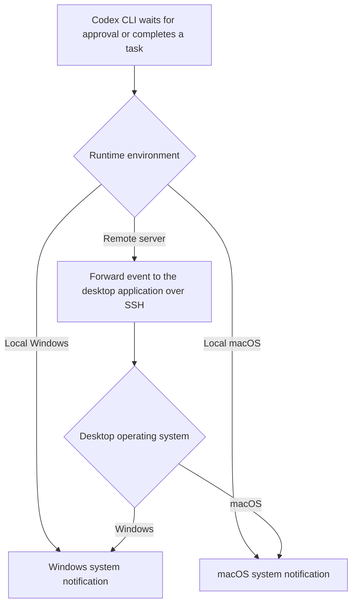
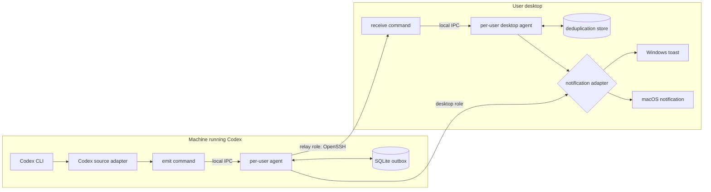
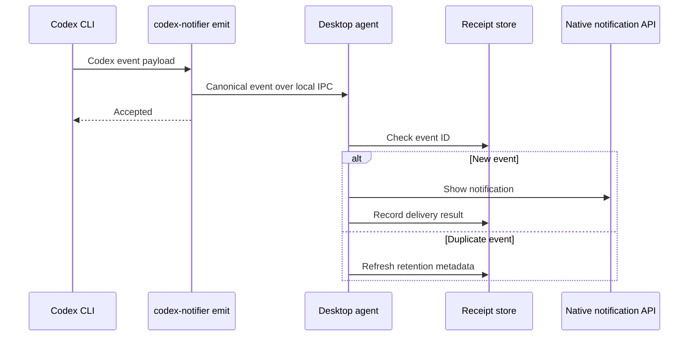
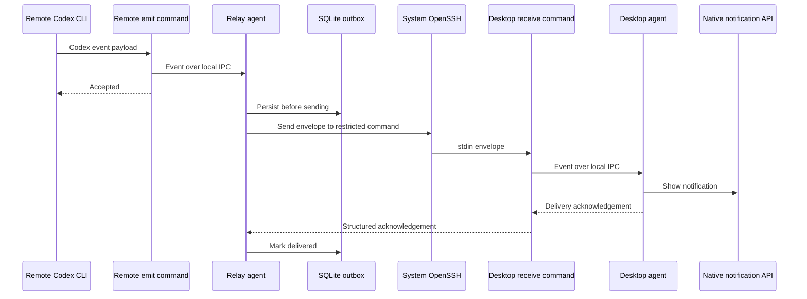

# codex-notifier

[简体中文](README-zh.md)

`codex-notifier` is a planned cross-platform notification bridge for Codex CLI.
It turns Codex events that need human attention into native Windows or macOS
notifications, including events produced by Codex running on a remote server.

> Status: Stages 01-04 are complete: compatibility evidence, architecture
> decisions, the Rust workspace, three-platform quality gates, and the
> canonical event domain model are established. Adapter and application
> behavior has not been implemented yet.

The implementation sequence and acceptance gates are defined in
[`stages.md`](stages.md).

## Product Scope

The first release targets two user-facing events:

- `approval_requested`: Codex is waiting for the user to approve an action.
- `task_completed`: a Codex turn or task has finished.

The original product flow is preserved below:



### Goals

- Deliver native notifications without exposing a network service publicly.
- Use the same event model for local and remote Codex sessions.
- Keep Codex hooks fast and non-blocking by handing work to a local agent.
- Survive temporary SSH failures with a bounded persistent queue.
- Package one small executable for emitters, relays, receivers, and diagnostics.
- Make installation and removal explicit and reversible.

### Non-goals

- Linux desktop notifications. Linux is supported only as a remote relay host.
- Mobile push, email, chat integrations, or a hosted relay service.
- Remote control of Codex from a notification.
- Transporting complete prompts, model responses, or terminal logs.
- Replacing Codex's own approval UI.

## Codex Integration Boundary

Codex integration is isolated behind source adapters because event availability
can differ by Codex version and interface.

| Product event | Required Codex capability | Planned behavior |
| --- | --- | --- |
| Task completed | An external notification/hook event for turn completion | Normalize the payload and enqueue `task_completed`. |
| Approval requested | An external notification/hook event for an approval request | Normalize the payload and enqueue `approval_requested`; report the feature as unavailable when the installed Codex version does not expose it. |

The implementation must detect capabilities during `doctor` and installation.
It must not scrape terminal output or private session logs as a silent fallback.
Before implementation, these adapter contracts must be checked against the
target Codex CLI release. This repository intentionally does not claim that all
Codex versions expose both events to external programs.

The initial version floor is Codex CLI 0.144.5. Stage 01 verified task
completion through the `codex exec` `Stop` hook and approval requests through
the app-server JSON-RPC interface on Windows 10 22H2. The ordinary CLI
`PermissionRequest` lifecycle-hook path remains unverified and must be reported
unavailable until real evidence exists. See
[`docs/compatibility.md`](docs/compatibility.md) and
[ADR-0001](docs/decisions/0001-supported-versions.md). The initial OS build
floors are Windows 10 22H2 (19045) and macOS 14; neither platform is a native
notification support claim until its required smoke tests pass.

## Architecture

The project uses a Rust workspace and a hexagonal architecture. Domain and
application logic do not depend on Codex payloads, SSH commands, IPC details,
or operating-system notification APIs.



### Runtime Roles

Runtime role is configured explicitly; it is not inferred from whether a
machine appears headless.

| Role | Typical host | Responsibility |
| --- | --- | --- |
| `desktop` | Windows or macOS workstation | Receive events over local IPC, deduplicate them, and show native notifications. |
| `relay` | Remote Linux, Windows, or macOS server | Receive local Codex events, queue them, and forward them to a configured desktop over SSH. |

The same executable supports both roles. A desktop role never needs SSH for
local notifications, and a relay role never calls desktop notification APIs.

### Components

| Component | Responsibility |
| --- | --- |
| Codex source adapter | Convert a version-specific Codex payload into the canonical event model. |
| `emit` command | Validate hook input and submit it to the agent through local IPC; return quickly to Codex. |
| Agent | Own routing, persistence, retry scheduling, deduplication, and graceful shutdown. |
| Local IPC adapter | Use a per-user Windows named pipe or Unix domain socket with user-only access. |
| SQLite store | Persist the relay outbox and desktop delivery receipts with bounded retention. |
| SSH transport | Invoke the system OpenSSH client with an argument array and a configured host alias. |
| `receive` command | Act as the restricted SSH entry point, validate one envelope, and submit it to the desktop agent. |
| Notification adapter | Map canonical events to Windows toast or macOS UserNotifications. |
| Installer | Configure Codex integration, user startup, and optional restricted SSH access. |
| Diagnostics | Report Codex event support, agent health, IPC permissions, SSH reachability, and notification permission. |

### Local Event Flow



### Remote Event Flow



The baseline remote topology assumes that the relay host can reach the desktop
through an SSH host alias, usually over a trusted LAN or VPN. Reverse tunnels
may be added later as a separate transport adapter; they are not part of the
first implementation.

## Event Contract

Every adapter produces a versioned canonical envelope. The logical fields are:

| Field | Purpose |
| --- | --- |
| `schema_version` | Allows compatible evolution of the wire format. |
| `event_id` | UUIDv7 generated at first ingestion and reused across retries. |
| `kind` | `approval_requested` or `task_completed`. |
| `occurred_at` | UTC timestamp from the source, bounded by receiver validation. |
| `source` | Sanitized host label, optional project label, and Codex session identifier. |
| `presentation` | Bounded title, body, and urgency intended for display. |
| `routing` | Optional desktop profile name; never an arbitrary command or address. |
| `extensions` | Namespaced, size-limited metadata for forward compatibility. |

Unknown required schema versions, event kinds, and object fields are rejected
in version 1. Prompt text, model output, environment variables, absolute
working directories, and credentials are excluded by default.

Protocol version 1 is frozen by
[ADR-0006](docs/decisions/0006-event-protocol-v1.md) and specified in
[`docs/event-protocol-v1.md`](docs/event-protocol-v1.md). Version 1 rejects
unknown event kinds and unknown object fields, limits an encoded event to
16,384 bytes, and permits forward metadata only through bounded namespaced
extensions.

## Delivery Semantics

- Submission from `emit` to the local agent is at-least-once.
- Remote delivery is at-least-once; the desktop deduplicates by `event_id`.
- An event is removed from the outbox only after a structured acknowledgement.
- Retries use exponential backoff with jitter and configurable upper bounds.
- Queue size, event size, retry age, and receipt retention are bounded.
- Permanent validation or authentication failures enter a small dead-letter
  record containing the reason and safe metadata, not the full payload.
- Notification API success means the OS accepted the notification, not that the
  user saw or opened it.

## Security Model

The trust boundary is the desktop `receive` command.

- Use the operating system's OpenSSH client; do not embed an SSH server.
- Use a dedicated SSH key and host alias for each relay-to-desktop relationship.
- Restrict the authorized key to `codex-notifier receive` with forwarding, PTY,
  shell, and unrelated command access disabled where the SSH server supports it.
- Pin or explicitly enroll the desktop host key; never disable host-key checks.
- Pass envelopes over stdin. Event data must never be interpolated into a shell
  command, command line, notification action, URL, or file path.
- Validate schema, kind, timestamps, string lengths, total size, and rate limits
  before the event reaches persistence or a native API.
- Limit local IPC and state files to the current OS user.
- Redact payloads from normal logs and never store SSH private keys in project
  configuration.
- Notifications are display-only in the first release and have no action button
  that can approve a Codex operation.

## Configuration Model

Configuration is layered in this order: built-in defaults, user configuration,
profile-specific configuration, and explicit CLI overrides. Environment
variables are reserved for deployment integration and must not carry event
payloads or private keys.

The planned configuration groups are:

| Group | Examples of owned settings |
| --- | --- |
| `agent` | Runtime role, IPC endpoint, startup behavior, shutdown timeout. |
| `codex` | Source adapter, accepted event kinds, installed hook ownership. |
| `desktop` | Native adapter options, quiet hours, title/body privacy level. |
| `relay` | SSH host alias, destination profile, timeouts, retry policy. |
| `storage` | State path, queue limits, receipt and dead-letter retention. |
| `logging` | Level, destination, redaction, rotation. |

The default notification privacy mode uses generic title/body text with no
host, project, command, prompt, response, or path. Application quiet hours are
off by default while OS focus/do-not-disturb remains authoritative; explicitly
enabled application quiet hours deliver silently rather than deferring stale
events. See [ADR-0003](docs/decisions/0003-notification-privacy.md).

User configuration and state follow platform conventions: `%APPDATA%` and
`%LOCALAPPDATA%` on Windows, and `~/Library/Application Support` on macOS.
Relay hosts follow the XDG base directory specification when available.

## Planned Command Surface

The final command names may change during implementation, but responsibilities
remain separated:

| Command | Purpose |
| --- | --- |
| `agent` | Run the per-user desktop or relay process. |
| `emit` | Codex-facing, fast local event ingestion. |
| `receive` | Restricted SSH-facing ingestion on the desktop. |
| `install` / `uninstall` | Manage Codex integration and user startup artifacts. |
| `doctor` | Run read-only capability and connectivity checks. |
| `test` | Send an explicit synthetic notification or end-to-end test event. |
| `status` | Show agent, queue, and last-delivery status without event content. |

## Repository Layout

The workspace packages now exist. Packages whose implementation belongs to a
later stage intentionally contain only a documented Rust module boundary.

```text
codex-notifier/
|-- Cargo.toml
|-- README.md
|-- README-zh.md
|-- LICENSE
|-- crates/
|   |-- core/                 # Event types, validation, routing, policies
|   |-- application/          # Use cases and ports
|   |-- codex-source/         # Version-specific Codex payload adapters
|   |-- ipc/                  # Named-pipe and Unix-socket adapters
|   |-- persistence/          # SQLite queue and receipt adapters
|   |-- ssh-transport/        # System OpenSSH process adapter
|   |-- native-notification/  # Windows and macOS adapters
|   `-- config/               # Layered configuration and migrations
|-- apps/
|   `-- codex-notifier/       # Binary, commands, agent lifecycle
|-- tests/
|   |-- contract/             # Event and acknowledgement compatibility
|   |-- integration/          # IPC, persistence, SSH process boundaries
|   `-- fixtures/             # Sanitized Codex payload fixtures
|-- packaging/
|   |-- windows/              # Packaging and per-user startup assets
|   |-- macos/                # Bundle, signing, and LaunchAgent assets
|   `-- linux-relay/          # systemd user service assets
`-- docs/
    |-- decisions/            # Architecture decision records
    |-- event-protocol-v1.md  # Frozen canonical event and acknowledgement contract
    |-- threat-model.md
    `-- compatibility.md
```

`core` and `application` must compile without platform notification or SSH
dependencies. Platform code lives in adapters selected at the binary boundary.

## Development

Install [rustup](https://rustup.rs/) once. The checked-in
[`rust-toolchain.toml`](rust-toolchain.toml) selects Rust 1.88.0 and installs
`rustfmt` and Clippy; no additional global Cargo package is required.

```text
cargo build --workspace
cargo fmt --all -- --check
cargo clippy --workspace --all-targets --all-features -- -D warnings
cargo test --workspace
```

CI runs the same quality gates on Windows, macOS, and a Linux relay runner.

## Observability and Operations

- Structured logs contain event IDs, event kinds, state transitions, durations,
  and safe error codes; display bodies are redacted by default.
- `status` reports queue depth, oldest queued age, and the most recent successful
  delivery time.
- Health checks are local-only and do not open an HTTP port.
- Database migrations are transactional and backward compatible for at least
  one released minor version.
- Shutdown stops accepting IPC, checkpoints in-flight work, and leaves
  unacknowledged events queued.

## Testing Strategy

- Unit tests cover validation, redaction, routing, retries, and deduplication.
- Contract tests freeze canonical event and acknowledgement compatibility.
- Integration tests exercise real local IPC, SQLite, and a fake OpenSSH process.
- Adapter tests use captured, sanitized Codex payload fixtures by version.
- Windows and macOS CI compile and test their native adapters.
- Manual release smoke tests verify real notifications and OS permissions on
  both supported desktop platforms.
- Security tests cover oversized input, malformed JSON, shell metacharacters,
  replayed event IDs, permission boundaries, and log redaction.

## Release Plan

1. Freeze the canonical event contract and verify target Codex event support.
2. Implement local ingestion, desktop agent, persistence, and native adapters.
3. Add diagnostics and reversible per-user installation.
4. Implement restricted SSH receive and relay outbox delivery.
5. Add packaging, signing/notarization, cross-platform CI, and upgrade tests.
6. Run Windows/macOS end-to-end release validation and publish compatibility
   notes for tested Codex versions.

## Accepted Architecture Decisions

| Area | Decision |
| --- | --- |
| Versions | [ADR-0001](docs/decisions/0001-supported-versions.md): Codex 0.144.5, Windows 10 22H2, and macOS 14 initial floors with evidence-gated support. |
| License | [ADR-0002](docs/decisions/0002-license.md): MIT. |
| Privacy | [ADR-0003](docs/decisions/0003-notification-privacy.md): generic private notifications by default; OS focus policy remains authoritative. |
| SSH | [ADR-0004](docs/decisions/0004-ssh-topology.md): direct system OpenSSH over a reachable LAN/VPN path; no reverse tunnel in version 1. |
| Release | [ADR-0005](docs/decisions/0005-release-channel.md): signed/notarized GitHub Release artifacts with checksums and SBOM. |
| Protocol | [ADR-0006](docs/decisions/0006-event-protocol-v1.md): strict bounded JSON envelope version 1. |

Signing identity identifiers remain external secrets owned by the release
maintainer and must be fixed before the first release candidate. This is a
release gate, not an unresolved protocol or product behavior decision.
